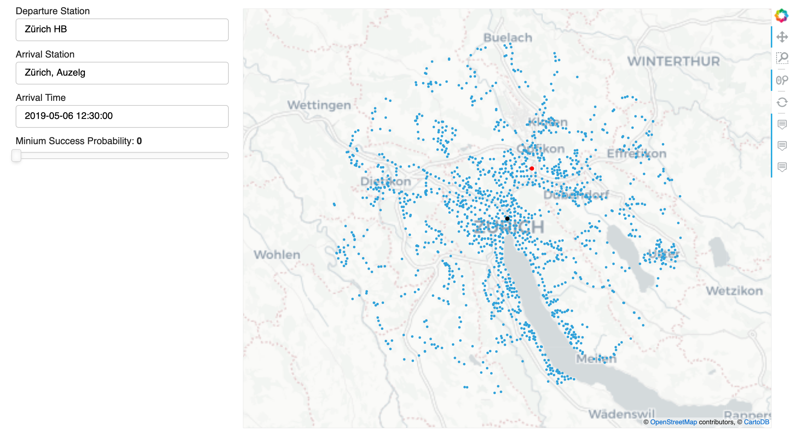
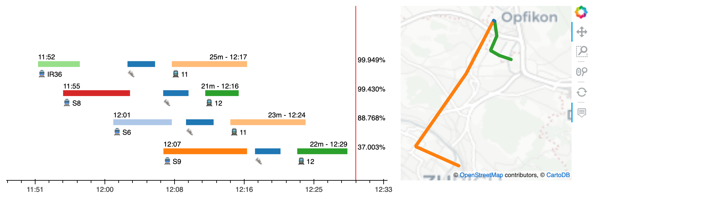

# Machine learning 
#### *Python code, using Tensorflow and Pytorch*

## [1. Road Segmentation](https://github.com/emdezla/projetRoadSegmentation)

In this machine learning project, I explored three different machine learning models (Logistic Regression, Convolutional Neural Network and U-net Neural Network) for implementing a binary classifier on satellite images in order to segment the road. The code is written in Python and the neural networks are defined using the high-level API Keras (Tensorflow). This project has allowed me to learn and put in practice concepts such as feature engineering, data aigmentation, model overfitting and image segmentation. At the end, the U-net neural network was chosen as the best model with a F1 score of 0.9. In the image below, the prediciton of two different neural networks are compared. 

## [2. Handwritten Digit Classification](https://github.com/emdezla/DeepLearning/tree/master/ConvolutionalNNs)

The objective of this project was to test different neural network architectures to compare two digits using images from MNIST dataset. It aims at showing in particular the impact of weight sharing, and of the use of an auxiliary loss to help the training of the main objective for convolutional layers. Pair of images are given as input and the output must predict if the first digit is less or equal to the second for each pair. The code is exclusvely written with Pytorch, no other external libraries are included. 

## [3. Custom Deep-Learning framework](https://github.com/emdezla/DeepLearning/tree/master/NeuralFramework)

In this project, a custom mini deep learning framework is coded using Pytorch tensor operations. The idea is to be able to build a complex machine learning model without using Pytorch autograd module. For that reason, every step (feed-forward, back-propagation and parameter optimisation) has to be explecitely computed in the framework. At the end, a neural netowk is trained with the aim of classifyng two-dimensional points and proving that the framework is properly working.

# Computational Motor Control
#### *Python code using PyBullet engine for simulations*

## [1. Salamander-Robotica Model](https://github.com/emdezla/SalamanderModel)
In this project, the natural movement of a salamander is simulated (swimming on water and walking on land). Good results are obtained thanks to the use of Central Pattern Generator model for defining the behaviour of the salamander spine and limb joints.After a fine paramater tuning of magnitudes shuch as amplitude gradient of phase lags, a smooth transition between walking and swimming is obtained.

# Data Science
#### *Pyspark code using Hadoop, Pandas, Bokeh and Kafka*

## [1. Robust jorney planner](https://github.com/emdezla/journey_planner)

In this project, a robust journey planner of the Swiss public transport network for the city of Zurich is developed. In other words, we tried to build our own custom "Google Maps" but also taking delay probability into account for prioritasing the less delayed connections. Using the [SBB CFF FFS data](https://opentransportdata.swiss/en/), we modeled the public transport infrastructure as a graph considering walks, transfers and historical delays of every transport connection over 2 years. Our algorithm is able to predict the fastest route to go from A to B in a way to maximize your chances to be on time! Below you can see a snapshot of the interface built with Bokeh

# Wireless Systems
#### *MatLab code*

# Image processing projects
#### *Python code using mostly OpenCV*

# Digital Systems
#### *VHDL and C Code*

# EXTRA: Covid-19 Pandemic
#### *Python code using Networkx*

